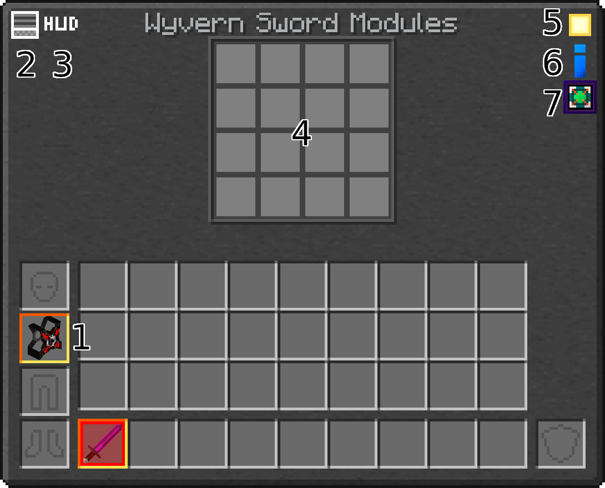

---
navigation:
  parent: modules/modules.md
  title: Module System
  position: -10
  icon: draconicevolution:module_core
item_ids:
  - draconicevolution:module_core
  - draconicevolution:item_draconium_energy
  - draconicevolution:item_draconium_speed
  - draconicevolution:item_wyvern_energy
  - draconicevolution:item_wyvern_speed
  - draconicevolution:item_wyvern_energy_link
  - draconicevolution:item_draconic_energy
  - draconicevolution:item_draconic_speed
  - draconicevolution:item_draconic_energy_link
  - draconicevolution:item_chaotic_energy
  - draconicevolution:item_chaotic_speed
  - draconicevolution:item_chaotic_energy_link
---

# Module System

<Column alignItems="center" fullWidth={true}>
    <Row>
        <ItemImage id="draconicevolution:wyvern_chestpiece" scale = "4"/>
        <ItemImage id="draconicevolution:draconic_bow" scale = "4"/>
        <ItemImage id="draconicevolution:chaotic_axe" scale = "4"/>
    </Row>
</Column>

Modules are what really make Draconic Evolution so special, allowing you to customize your items exactly how you want. Press **<KeyBind id="key.sneak" /> + <KeyBind id="key.draconicevolution.tool_config" />** to open the menu.

In this menu, you can:
1. Click on a modular item in your inventory to modify it
2. Switch to Item Configuration mode
3. Adjust the Shield Controller HUD
4. Insert, remove, and rearrange modules
5. Switch between dark and light mode
6. Show extra information about the current item
7. Show a list of supported modules for the current item

# Module Management
A few important points:
- Your item's Module Grid is similar to a regular inventory. The main difference is that some modules take more than one space. Most modules can be upgraded to increase their stats, meaning you can get the same benefits while using less module space. Modules will list their size in their tooltip, along with other relevant information.
- Modules come in four tiers:
  - Chaotic modules are only supported in Chaotic items
  - Draconic modules are supported in Chaotic and Draconic items
  - Wyvern and Draconium modules are supported in all items
- Some modules are adjustable, which can be done in Item Configuration mode.

# General Modules

## <ItemImage id="draconicevolution:item_draconium_energy" scale = "0.5"/> <ItemLink id="draconicevolution:item_draconium_energy"/>
*Supported in all items.*

Energy modules increase the capacity and transfer rate of OP. All modular items need at least one Energy module in order to function properly.

## <ItemImage id="draconicevolution:item_draconium_speed" scale = "0.5"/> <ItemLink id="draconicevolution:item_draconium_speed"/>
*Supported in chestpieces, bows, and all tools.*

Speed modules increase:
- Attack speed for tools
- Dig speed for tools (adjustable)
- Draw speed for bows
- Movement speed for chestpieces (adjustable)

## <ItemImage id="draconicevolution:item_wyvern_energy_link" scale = "0.5"/> <ItemLink id="draconicevolution:item_wyvern_energy_link"/>
*Supported in all items.*

**<KeyBind id="key.sneak"/> + <KeyBind id="key.use"/>** to link your <ItemLink id="draconicevolution:item_wyvern_energy_link"/> to an [Energy Core](../power_generation_storage_transfer/storage/energy_core.md). When activated, transfers energy from your [Energy Core](../power_generation_storage_transfer/storage/energy_core.md) to your item. (adjustable)

Requires OP to activate and to stay activated.

<RecipeFor id="draconicevolution:module_core"/>