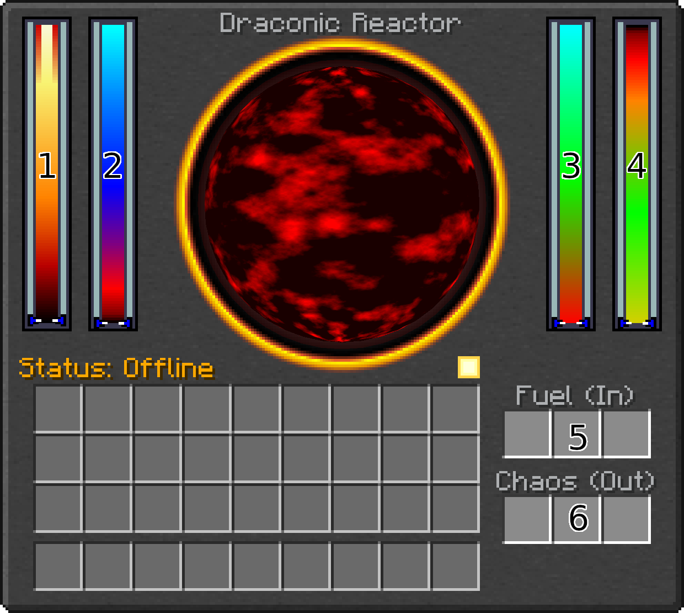

---
navigation:
  parent: power_generation_storage_transfer/power_generation_storage_transfer.md
  title: On the Subject of Draconic Reactors
  icon: draconicevolution:reactor_stabilizer
---

# On the Subject of Draconic Reactors
### Keep Reading, and Nobody Explodes

# A word of warning
As unlikely as it is, make sure you don't consume power from your storage system faster then the reactor can generate it. If you run out of power, you wont be able to maintain your reactor's shields. It's recommend to use a <ItemLink id="draconicevolution:flux_gate" /> to regulate how much power is extracted from your power storage. Keep that gate set lower than the profit rate of your reactor.

# The GUI

Here's the reactor GUI:

1. Temperature: If the reactor gets too hot, it explodes. Keep your reactor below 8000°C.
2. Containment Field Strength: If this gets too low, the reactor explodes.
3. Energy Saturation: How much energy is stored in the reactor.
4. Fuel Conversion Level: How much of the fuel has been depleted. If this gets too high, the reactor runs out of fuel, and explodes.

The following are only available while the reactor is not running:

5. Fuel Input: Accepts up to eight <ItemLink id="draconicevolution:awakened_draconium_block" />s. Also accepts <ItemLink id="draconicevolution:awakened_draconium_ingot" />*s* and <ItemLink id="draconicevolution:awakened_draconium_nugget" />s.
6. Chaos Output: Storage for depleted fuel, in the form of Chaos Fragments.

# Reactor Status
The various reactor status codes, and what they mean.

## Offline
The only mode where you can insert and extract fuel, and disassemble the reactor.

## Warming Up
This mode requires a significant amount of power in order to prime the reactor. Power can be inserted through the <ItemLink id="draconicevolution:reactor_injector" />.

With enough power, the following will happen:
1. The shields charge to 50%.
2. The core charges to 50%
3. The temperature increases to 2000°C.
4. The reactor will be primed for activation.

## Online
While your reactor is online, you must maintain a balance between the amount of energy you supply the containment field and the amount of energy you extract.

The more power you pull from the reactor, the more the reactor's saturation will drop. The reactor will compensate for this by increasing its generation rate to match the rate at which you are extracting energy.

As the generation rate increases, so does the temperature. This results in an increased load on the containment field that will weaken the containment field strength. If the core temperature goes beyond 8000°C, the containment field will be weakened exponentially. This either results in horrible efficiency, or a horrible explosion.

However, the higher the core temperature, the faster the reactor will burn fuel. The fusion of draconium in the core of the reactor produces Chaos Fragments, like the ones found in [Chaos Islands](../../chaos.md).

As the level of chaos within the core increases, so does the reactivity of the fuel. This higher reactivity increases the efficiency of the reactor, and means that as the fuel is converted, you will be able to pull more and more power from the reactor while maintaining a stable temperature, up to several *million* OP/tick before having to refuel.

> <Color id="red"> WARNING: You MUST shut down and refuel the reactor **before** the conversion level reaches 100%! Chaos is highly unstable and without *some* amount of fuel in the core, it can't be regulated. This will result in an unstoppable runaway thermal reaction, until the containment field fails, resulting in a catastrophic explosion.</Color>

## Stopping

> <Color id="red"> WARNING: Before you shut down your reactor, make sure you have a *significant* backlog of power to supply the containment field while it shuts down!</Color>

When you shut down the reactor, it will immediately stop generating power and start the shutdown process. This requires the reactor to charge its saturation to near 100%, thus allowing the generation rate to drop, which allows the temperature to drop. Once the saturation passes around 99%, the temperature will drop below 2000°C, fusion will cease, and the reactor will enter cooldown.

## Cooling Down

At this point, fusion has stopped, and the containment field is shutting down. After the core cools sufficiently, you will be able to refuel or dissmantle the reactor.

## --Explosion Imminent!!!--
[...I have a song for you to listen to.](https://www.youtube.com/watch?v=iIpfWORQWhU)
In all seriousness, it's too late for your reactor, and everything within a kilometer.

# Reactor Stability

There are a number of ways you can manage your reactor. The first being to just do it manually. This is fine in theory; as long as you get a stable balance between power supplied to the field and power extracted from the core, it *should* be fine. As the core burns through its fuel and the effiency increases, the shield strength should only increase.

But, if you want to be able to tweak your power settings to get more from your reactor as its efficency increases (or even if you don't), it's nice to have some system to help prevent a nasty explosion.

## Redstone
You can regulate your reactor using nothing but vanilla redstone! While a reactor is warming up, you can adjust what a <ItemLink id="draconicevolution:reactor_stabilizer" /> will output to a <ItemLink id="minecraft:comparator" />. You can output the values for temperature, shields, energy saturation, and conversion rate.

Semi-Automated-Shutdown mode will shutdown the reactor if the temperature drops below 2500°C and energy saturation reaches 99%.

## CC: Tweaked
If you know how to program in Lua, you can take things a step further and control your reactor with a computer!

Attaching a computer to a stabilizer or energy injector exposes 5 methods.

- `getReactorInfo`: Returns a table containing the following: `temperature`, `fieldStrength`, `maxFieldStrength`, `energySaturation`, `maxEnergySaturation`, `fuelConversion`, `maxFuelConversion`, `generationRate`, `fieldDrainRate`, `fuelConversionRate`, `status`, and `failSafe`.
- `chargeReactor`: Equivalent to pressing the Charge button in the GUI.
- `activateReactor`: Equivelent to pressing the Activate button in the GUI.
- `stopReactor` Equivelent to pressing the Shut Down button in the GUI.
- `setFailSafe` Allows you to enable/disable failsafe mode.

You can also control a <ItemLink id="draconicevolution:flux_gate" /> directly with your computer.